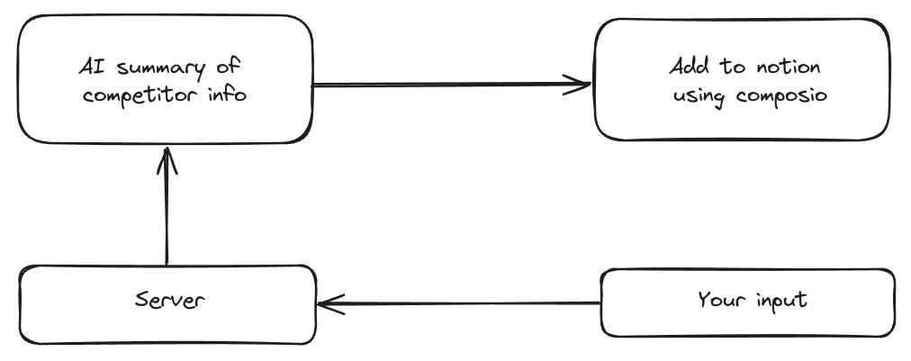

# Competitor Researcher

This is a project that let's you get information on a comeptitor's website and add it to your notion.

- It's built using Next.js, Python and composio SDK (it makes it soooo easy to add the info to notion).



## Demo
The video is at 2x

https://github.com/anonthedev/competitor-researcher/assets/84020006/4ac3afaa-8e9d-4d89-8fab-5e37fe4dd9b8


## To setup the project, follow these instructions
### To setup the backend:
- Go to the backend directory 
```
cd ./backend
```
- Create a .env file and add your OPENAI api key - 
```
OPENAI_API_KEY=sk-
```
- Create a virtual env (we used python3.12) - 
```
python -m venv env
source env/bin/activate
```
- Install the required packages - 
```
pip install -r requirements.txt
```
- Run the python file - 
```
python main.py
```

### To setup the frontend:
- Go to the frontend dir - 
```
cd ./frontend
```
- Install the required packages, run - 
```
npm i
```
- Create a file called .env.local and add 
```
NEXT_PUBLIC_BASE_URL = http://127.0.0.1:5000
``` 
(OR  whatever you choose your dev server to be)
- Run the development server by using - 
```
npm run dev
```

Now add some awesome features and send us a PR.
